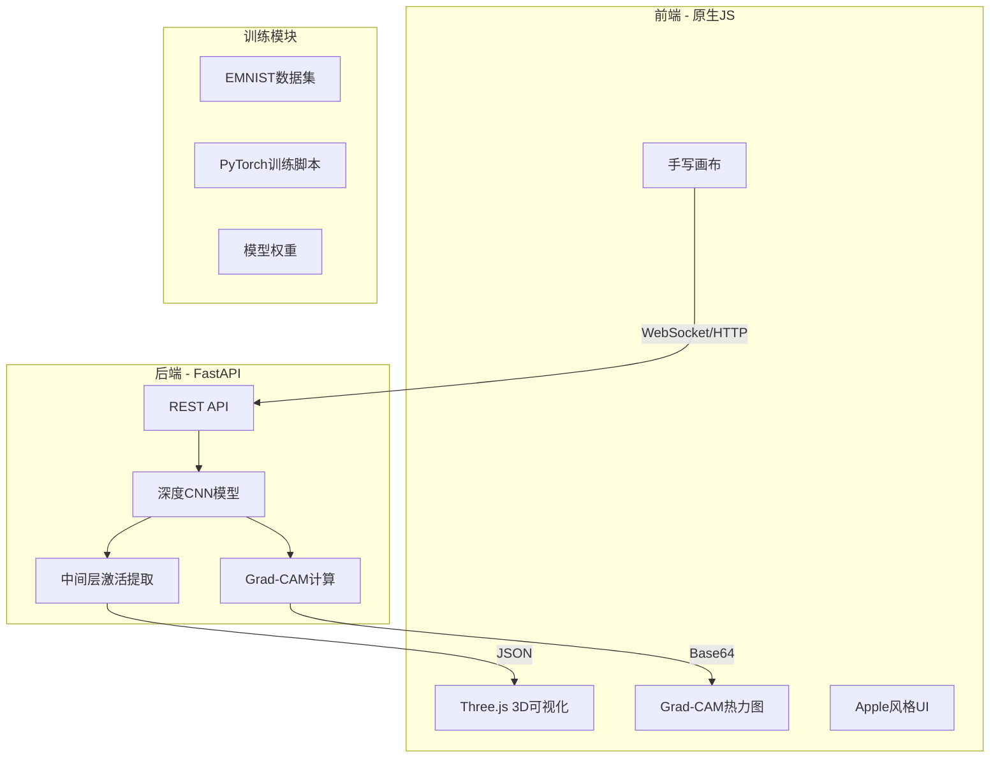

# 深度CNN可视化交互项目

## 项目架构概览




## 目录结构

```javascript
deepcnnvis/
├── backend/
│   ├── app/
│   │   ├── __init__.py
│   │   ├── main.py              # FastAPI 入口
│   │   ├── model.py             # CNN模型定义
│   │   ├── inference.py         # 推理逻辑
│   │   └── gradcam.py           # Grad-CAM实现
│   ├── weights/                  # 训练好的模型权重
│   └── requirements.txt
├── training/
│   ├── train.py                  # 训练脚本
│   ├── dataset.py                # EMNIST数据加载
│   └── config.py                 # 超参数配置
├── frontend/
│   ├── index.html
│   ├── css/
│   │   └── style.css             # Apple风格样式
│   └── js/
│       ├── main.js               # 主逻辑
│       ├── canvas.js             # 手写画布
│       ├── network3d.js          # Three.js 3D可视化
│       └── gradcam.js            # 热力图叠加
├── .gitignore
└── README.md
```


## 1. 深度CNN模型设计

设计一个具有较深结构和适量参数的CNN网络（约2-5M参数），专为手写字符识别优化：

```python
# 类VGG+残差结构的深度CNN
class DeepCharCNN(nn.Module):
    # 输入: 1x64x64 灰度图
    # 网络结构:
    # - 初始卷积块: 1 -> 64 channels
    # - 残差块组1: 64 -> 128, 2个残差块
    # - 残差块组2: 128 -> 256, 3个残差块  
    # - 残差块组3: 256 -> 512, 3个残差块
    # - 全局平均池化
    # - 全连接层: 512 -> 256 -> 62类
    # 
    # 特点: BatchNorm, ReLU, Dropout, Skip Connections
```


## 2. 训练流程

- **数据集**: EMNIST ByClass (62类，814k样本)
- **数据增强**: 随机旋转、平移、缩放、弹性变形
- **优化器**: AdamW + Cosine Annealing
- **训练**: RTX 5080上约30-60分钟达到95%+准确率

## 3. 后端API设计

使用 FastAPI 提供高性能异步API：| 端点 | 方法 | 功能 |

|------|------|------|

| `/predict` | POST | 图像推理 + Grad-CAM + 所有层激活 |

| `/health` | GET | 服务健康检查 |响应结构：

```json
{
  "prediction": "A",
  "confidence": 0.97,
  "top5": [["A", 0.97], ["H", 0.02], ...],
  "gradcam": "data:image/png;base64,...",
  "activations": {
    "conv1": {"shape": [64, 32, 32], "data": [...]},
    "res_block1": {"shape": [128, 16, 16], "data": [...]},
    ...
  }
}
```


## 4. 前端3D可视化设计

使用 Three.js 构建分层神经网络3D模型：


- 每层用3D立方体/平面阵列表示
- 神经元激活强度映射为颜色亮度（冷->热）
- 层间连接线条可选显示
- 支持旋转、缩放、平移交互

## 5. UI/UX设计 (Apple风格)

- **配色**: 白色(#FFFFFF)背景，浅灰(#F5F5F7)卡片，深灰(#1D1D1F)文字
- **字体**: SF Pro Display / Inter
- **动效**: 贝塞尔曲线过渡，微妙阴影
- **布局**: 左侧手写区+结果，右侧3D可视化

## 6. 实施步骤